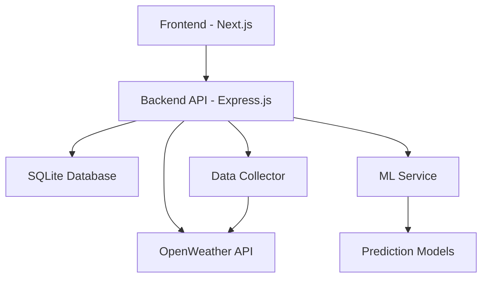

# 🌬️ AirSense - Advanced Air Quality Monitoring System

<div align="center">


**Real-time Air Quality Monitoring & ML-Powered Pollution Prediction for Bengaluru**

[](https://nodejs.org/)
[](https://nextjs.org/)
[](https://www.typescriptlang.org/)
[](LICENSE)

</div>

---

## 📋 Table of Contents

- [🌟 Features](#-features)
- [🏗️ Architecture](#️-architecture)
- [⚡ Quick Start](#-quick-start)
- [🔧 Detailed Setup](#-detailed-setup)
- [🚀 Running the Application](#-running-the-application)
- [🔍 Troubleshooting](#-troubleshooting)
- [📊 API Documentation](#-api-documentation)
- [🤝 Contributing](#-contributing)

---

## 🌟 Features

### 🔬 **Advanced Analytics & ML**
- ✅ **Real-time Air Quality Monitoring** - Live PM2.5, PM10, NO2, SO2, CO, O3 measurements
- ✅ **Machine Learning Predictions** - AI-powered 24-hour pollution forecasting
- ✅ **Weather Correlation Analysis** - Complete meteorological data integration
- ✅ **Trend Analysis** - Historical data analysis with seasonal patterns
- ✅ **Confidence Scoring** - ML model reliability indicators

### 💎 **Premium UI/UX**
- ✅ **Dark Theme Dashboard** - Professional interface with glass morphism effects
- ✅ **Smooth Animations** - Framer Motion powered transitions
- ✅ **Interactive Charts** - Real-time data visualization with Recharts
- ✅ **Responsive Design** - Mobile-first approach with adaptive layouts
- ✅ **Health Alerts** - Smart notifications based on air quality levels

### 🛡️ **Enterprise Features**
- ✅ **Rate Limiting** - API protection with configurable limits
- ✅ **Error Handling** - Comprehensive error management
- ✅ **Data Validation** - Input sanitization and validation
- ✅ **Automated Backups** - Database backup and retention policies
- ✅ **Health Monitoring** - System status and performance metrics

---

## 🏗️ Architecture



**Technology Stack:**
- **Frontend:** Next.js 14, React 18, TypeScript, Tailwind CSS, Framer Motion
- **Backend:** Node.js, Express.js, SQLite3, Machine Learning algorithms
- **External APIs:** OpenWeather API for real-time data
- **Deployment:** Docker, PM2, Nginx (optional)

---

## ⚡ Quick Start

### Prerequisites Checklist

Before starting, ensure you have:

- [ ] **Node.js 18+** installed ([Download here](https://nodejs.org/))
- [ ] **npm 8+** package manager
- [ ] **OpenWeather API Key** ([Get free key](https://openweathermap.org/api))
- [ ] **Git** for version control
- [ ] **4GB+ RAM** recommended
- [ ] **Stable internet connection**

### 🚀 One-Command Setup

```bash
# Clone and setup everything
git clone https://github.com/your-username/airsense.git
cd airsense
node scripts/setup.js
```

---

## 🔧 Detailed Setup

### Step 1: Clone Repository

```bash
git clone https://github.com/your-username/airsense.git
cd airsense
```

### Step 2: Install Dependencies

```bash
# Install all dependencies (root, backend, frontend)
npm run install:all
```

### Step 3: Configure Environment Variables

#### 🔑 Backend Configuration

Create `backend/.env`:

```bash
cd backend
cp .env.example .env
```

Edit `backend/.env`:

```env
# 🌤️ OpenWeather API (REQUIRED)
OPENWEATHER_API_KEY=your_api_key_here

# 🖥️ Server Configuration
PORT=3001
NODE_ENV=development
FRONTEND_URL=http://localhost:5000

# 💾 Database
DB_PATH=./database/air_quality.db

# 🤖 ML Configuration
MODEL_UPDATE_INTERVAL=3600000
PREDICTION_CONFIDENCE_THRESHOLD=0.7
```

#### 🎨 Frontend Configuration

Create `frontend/.env.local`:

```bash
cd ../frontend
cp .env.example .env.local
```

Edit `frontend/.env.local`:

```env
# 🔗 API Configuration (REQUIRED)
NEXT_PUBLIC_API_URL=http://localhost:3001/api

# 📱 App Configuration
NEXT_PUBLIC_APP_NAME=AirSense
NEXT_PUBLIC_REFRESH_INTERVAL=30000
```

### Step 4: Get OpenWeather API Key

1. 🌐 Visit [OpenWeather API](https://openweathermap.org/api)
2. 📝 Sign up for a free account
3. 🔑 Generate API key (takes ~10 minutes to activate)
4. 📋 Copy key to `backend/.env` file

> **💡 Tip:** Free tier includes 1000 calls/day with air pollution data

---

## 🚀 Running the Application

### Method 1: Development Mode (Recommended)

```bash
# Start both frontend and backend
npm run dev
```

This will start:
- 🖥️ **Backend API:** http://localhost:3001
- 🌐 **Frontend App:** http://localhost:5000
- 📊 **API Health:** http://localhost:3001/api/health

### Method 2: Individual Services

```bash
# Terminal 1 - Backend
npm run dev:backend

# Terminal 2 - Frontend  
npm run dev:frontend
```

### Method 3: Production Mode

```bash
# Build applications
npm run build

# Start production server
npm start
```

### Method 4: Docker (Advanced)

```bash
# Build and run with Docker
docker-compose up --build

# Run in background
docker-compose up -d
```

---

## 🔍 Troubleshooting

### Common Issues & Solutions

#### ❌ **"Failed to fetch air quality data"**

**Causes & Solutions:**

1. **API Key Issues:**
   ```bash
   # Check if API key is set
   grep OPENWEATHER_API_KEY backend/.env
   
   # Test API key
   curl "http://api.openweathermap.org/data/2.5/weather?lat=12.9716&lon=77.5946&appid=YOUR_API_KEY"
   ```

2. **Backend Not Running:**
   ```bash
   # Check backend status
   npm run health
   
   # Restart backend
   cd backend && npm run dev
   ```

3. **Port Conflicts:**
   ```bash
   # Kill processes using ports
   lsof -ti:3001 | xargs kill -9  # Backend
   lsof -ti:5000 | xargs kill -9  # Frontend
   ```

#### ❌ **"CORS Error" or "Network Error"**

**Solution:**
```bash
# Check environment variables
echo $NEXT_PUBLIC_API_URL  # Should be http://localhost:3001/api

# Restart both services
npm run dev
```

#### ❌ **"Database Error"**

**Solution:**
```bash
# Check database permissions
ls -la backend/database/

# Create database directory
mkdir -p backend/database

# Restart backend to recreate database
cd backend && npm run dev
```

#### ❌ **"Module Not Found" Errors**

**Solution:**
```bash
# Clean install all dependencies
rm -rf node_modules package-lock.json
rm -rf backend/node_modules backend/package-lock.json  
rm -rf frontend/node_modules frontend/package-lock.json

npm run install:all
```

#### ❌ **"Memory Issues"**

**Solution:**
```bash
# Increase Node.js memory limit
export NODE_OPTIONS="--max-old-space-size=4096"
npm run dev
```

### 🔧 Debug Mode

```bash
# Enable detailed logging
DEBUG=* npm run dev

# Backend only debugging  
cd backend && DEBUG=backend:* npm run dev

# Check system status
curl http://localhost:3001/api/system/status
```

### 📊 Health Checks

```bash
# Quick health check
npm run health

# Detailed system status
curl -s http://localhost:3001/api/system/status | jq

# Check data collection
curl -s http://localhost:3001/api/air-quality/current/bengaluru | jq
```

---

## 📊 API Documentation

### Base URL
```
Development: http://localhost:3001/api
```

### Key Endpoints

#### Air Quality
```bash
# Current data
GET /air-quality/current/bengaluru

# Historical data  
GET /air-quality/history/bengaluru?hours=24

# Trends analysis
GET /air-quality/trends/bengaluru?period=day
```

#### Predictions
```bash
# ML predictions
GET /predictions/bengaluru?hours=24

# Model performance
GET /predictions/performance/bengaluru
```

#### System Health
```bash
# Health check
GET /health

# System status
GET /system/status
```

### Example Response

```json
{
  "success": true,
  "data": {
    "location": "bengaluru",
    "timestamp": "2024-01-15T10:30:00.000Z",
    "pm25": 45.2,
    "pm10": 78.5,
    "aqi": 95,
    "temperature": 26.5,
    "humidity": 68
  }
}
```

---

## 🎯 Features Walkthrough

### 📊 **Dashboard Overview**
- Real-time AQI display with color-coded status
- Interactive charts showing pollution trends
- Weather integration with current conditions
- Health recommendations based on air quality

### 🤖 **ML Predictions**
- 24-hour pollution forecasts
- Confidence scoring for predictions
- Multiple algorithm ensemble (Linear, Polynomial, Time Series)
- Weather correlation analysis

### 🚨 **Smart Alerts**
- Health advisories based on AQI levels
- Sensitive group warnings
- Outdoor activity recommendations
- Real-time notification system

### 📈 **Analytics**
- Historical trend analysis
- Seasonal pattern recognition
- Data quality metrics
- System performance monitoring

---

## 🔒 Security Features

- **Rate Limiting:** 100 requests per 15 minutes
- **CORS Protection:** Configurable origin whitelist
- **Input Validation:** Joi schema validation
- **Error Sanitization:** No sensitive data exposure
- **SQL Injection Prevention:** Parameterized queries

---

## 🚀 Deployment Options

### Option 1: VPS/Cloud Server
```bash
# Production deployment with PM2
pm2 start ecosystem.config.js --env production
```

### Option 2: Docker
```bash
# Docker deployment
docker-compose -f docker-compose.prod.yml up -d
```

### Option 3: Vercel + Railway
- Frontend: Deploy to Vercel
- Backend: Deploy to Railway
- Database: Persistent storage

---

## 📱 Mobile Support

- **Responsive Design:** Works on all screen sizes
- **Touch Optimized:** Swipe gestures and touch interactions
- **Performance:** Optimized for mobile networks
- **PWA Ready:** Progressive Web App capabilities

---

## 🤝 Contributing

We welcome contributions! Here's how to get started:

### Development Workflow

1. **Fork the repository**
2. **Create feature branch:** `git checkout -b feature/amazing-feature`
3. **Install dependencies:** `npm run install:all`
4. **Start development:** `npm run dev`
5. **Make changes and test**
6. **Commit:** `git commit -m 'Add amazing feature'`
7. **Push:** `git push origin feature/amazing-feature`
8. **Create Pull Request**

### Code Standards
- **TypeScript:** Strict mode enabled
- **ESLint:** Airbnb configuration
- **Prettier:** Code formatting
- **Conventional Commits:** Commit message format

---

## 📄 License

This project is licensed under the MIT License - see the [LICENSE](LICENSE) file for details.

---

## 🙏 Acknowledgments

- **OpenWeather API** for comprehensive environmental data
- **React/Next.js Community** for excellent documentation
- **Bengaluru Air Quality Board** for validation data
- **Open Source Community** for amazing tools and libraries

---

## 📞 Support

### Getting Help

- 📖 **Documentation:** Check this README and API docs
- 🐛 **Bug Reports:** Create GitHub issue
- 💡 **Feature Requests:** Open GitHub discussion
- 🔧 **Troubleshooting:** See troubleshooting section above

### Quick Links

- **Live Demo:** [Coming Soon]
- **API Documentation:** See [API_DOCUMENTATION.md](API_DOCUMENTATION.md)
- **Deployment Guide:** See [DEPLOYMENT_GUIDE.md](DEPLOYMENT_GUIDE.md)

---

<div align="center">

**🌱 Built with passion for cleaner air and better health in Bengaluru 🇮🇳**

*Last updated: January 2025 | Version 2.0.0*

---

### ⚡ Quick Start Checklist

- [ ] Clone repository: `git clone <repo-url>`
- [ ] Install dependencies: `npm run install:all`
- [ ] Get OpenWeather API key from [openweathermap.org](https://openweathermap.org/api)
- [ ] Configure `backend/.env` with API key
- [ ] Configure `frontend/.env.local` with API URL
- [ ] Run application: `npm run dev`
- [ ] Open http://localhost:5000
- [ ] Verify data loading (may take 2-3 minutes initially)

**🆘 Need help?** Check the [troubleshooting section](#-troubleshooting) or create an issue!

</div>